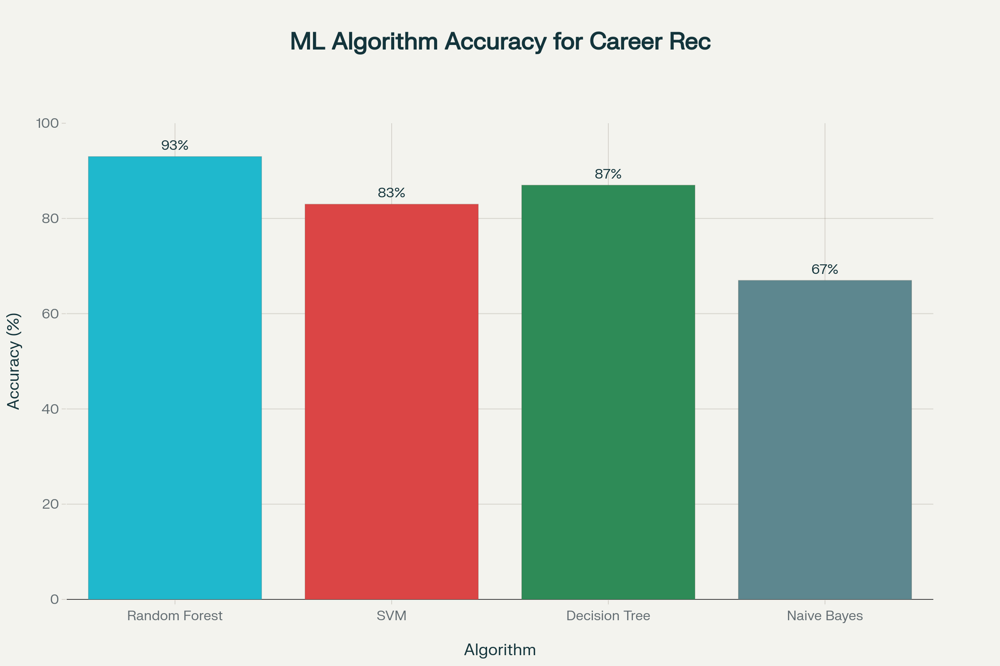

🚀 Smart Career Advisor (MVP)

AI-powered career recommendation web app that suggests optimal career paths based on users’ skills, academic performance, and interests.
Built with a clean UI and a machine learning core (Random Forest + feature extraction), this MVP delivers personalized, explainable career guidance in just a few steps.

✨ Features

User Input Module – Collects grades, skills, interests, and basic info interactively.

Data Preprocessing – Cleans, standardizes, and formats raw inputs for analysis.

Feature Extraction – Uses TF-IDF vectorization (or embeddings) for effective modeling.

Recommendation Engine – Random Forest predicts top career options with confidence scores.

Explanations – 2–3 personalized career recommendations, each with a simple reasoning.

Skill Gap Analysis – Highlights missing skills for the desired career path.

Responsive UI – Card-based layouts, step progress, loading animations, and results dashboard.

🖥️ Live Demo

👉 Try Smart Career Advisor MVP
 

📸 Screenshots
Welcome Page	ML Performance Chart
()

	
⚙️ Tech Stack

Frontend – Vanilla JavaScript (prototype UI)

Backend (optional) – Python with Flask (API) / Django (full stack)

ML Libraries – scikit-learn (RandomForestClassifier, TfidfVectorizer)

Data – Seeded sample data (no DB required for MVP)

🧩 System Architecture
graph LR
A[User Input] --> B[Data Preprocessing]
B --> C[Feature Extraction (TF-IDF)]
C --> D[Random Forest Model]
D --> E[Career Recommendations & Explanations]

📦 How to Run
🔹 Frontend-Only Prototype
git clone https://github.com/ayush-7747/smart-career-advisor-mvp.git
cd smart-career-advisor-mvp

Open index.html in your browser.

🔹 With Python Backend (Optional)

Install dependencies:

pip install -r requirements.txt

Start backend:

python app.py
# or Flask: flask run
# or Django: python manage.py runserver

Open browser → http://localhost:5000

🛠️ MVP Workflow

User fills out form (grades, skills, interests).

Data is cleaned + vectorized (TF-IDF).

Random Forest predicts career matches.

Results displayed → recommendations + explanations + skill gaps.

🎯 Why This MVP?

Quick user feedback collection

Easy to extend (swap TF-IDF → CNN/resume parsing)

Foundation for real-time market data integration

🚫 Not Yet Included

Real-time job market data

CNN-based resume parsing

Continuous learning from user feedback

Visual analytics dashboard

Database for persistent storage

🤝 Contributing

Fork & clone repo

Create a feature branch:

git checkout -b my-feature

Commit & push changes

Submit a Pull Request

📄 License

MIT License © 2025 [Your Name]

💡 Created to deliver simple, actionable career guidance.
Feedback & suggestions welcome → open an issue or discussion
